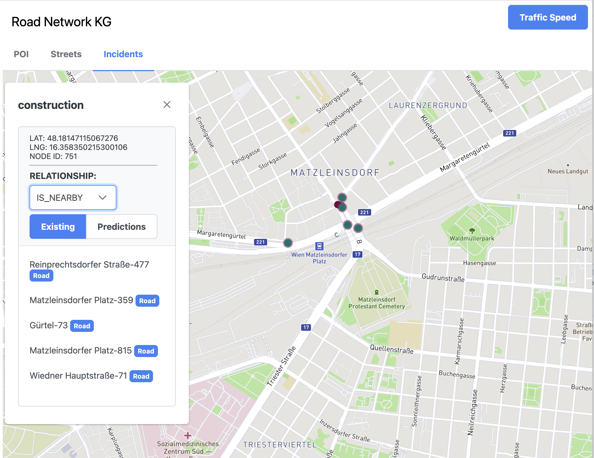
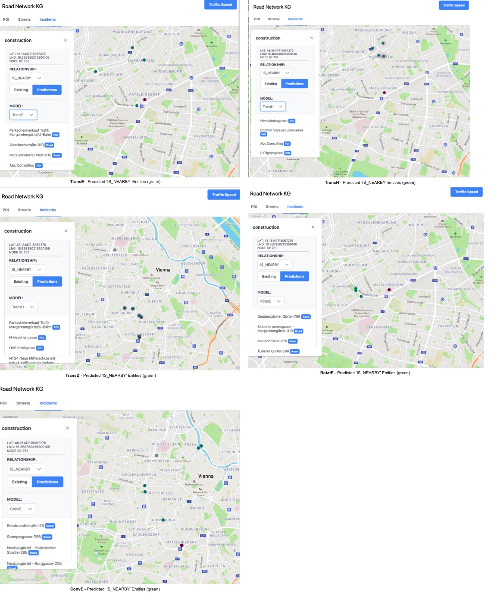
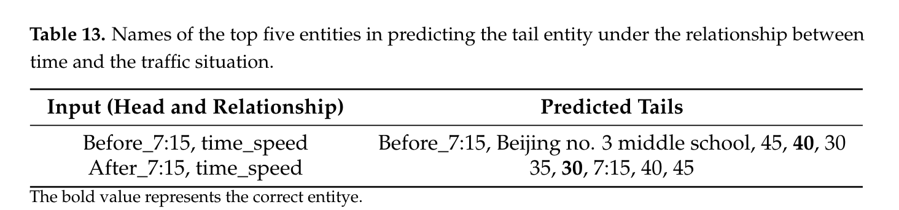
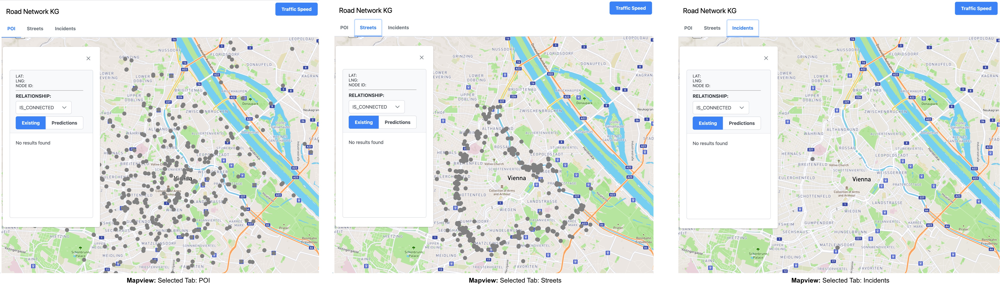
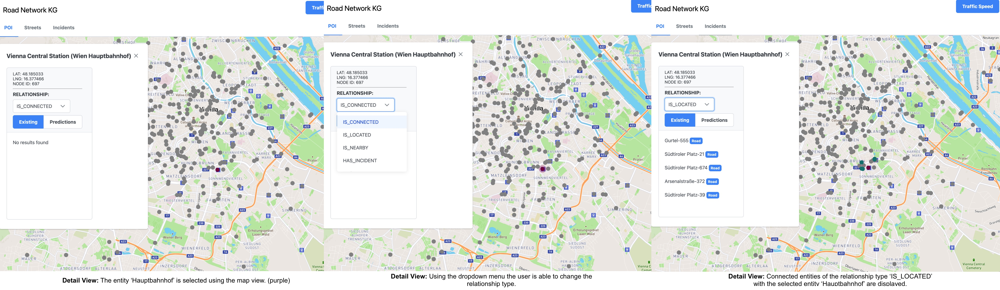
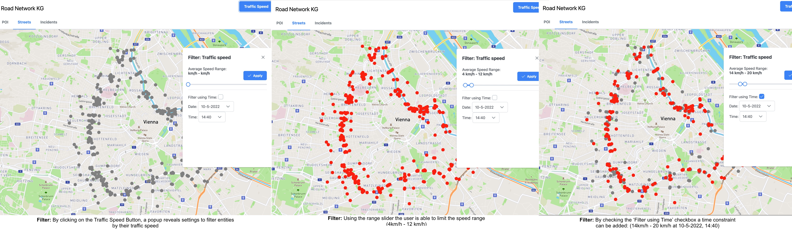
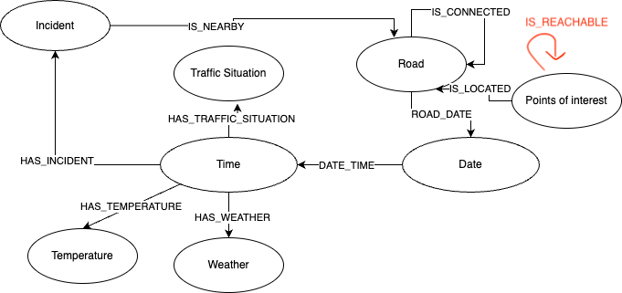

# Knowledge Graph in the Transportation Context

## Motivation
Transportation network optimisation is a challenge that traffic planners / mobility providers are facing. In this area efficiency gains, through better planning, leads to reduced costs and benefits for customers through optimised traffic situations.
The paper “Research on the Construction of a Knowledge Graph and Knowledge Reasoning Model in the Field of Urban Traffic” by Tan et. al. (https://www.mdpi.com/2071-1050/13/6/3191) introduced a solution using a knowledge graph by linking multiple data sources, such as time-dependent passenger trip data, public transport network data. traffic congestion data on streets, road network data and a list of points of interests. Using reasoning models (TransE / TransD) the researchers were able to predict traffic congestion in specific time frames, in relationship to specific point of interests. (e.g. in the paper: schools)

In contrast to the proposal and for time constraint reasons, the construction of the public transit network graph was left out. Since it's only purpose in the paper was to demonstrate the use-case of finding the shortest path between two stations using a Cypher query, it also wouldn't have added a lot of value to this project.

## Method
The project is divided into 6 sub-parts where the final KG is constructed incrementally. The implementation code can be found in their according subfolders in the submission package

1. <b> Data acquisition:</b> </br>
This project contains code to fetch the data from various data sources providing Road Traffic, Road Incident, Weather, POI (Points of Interest) data.
2. <b> Data processing:</b> </br>
In this project the data acquired from the previous step is processed to extract and transform the values to prepare for the integration to the KG. 
3. <b> Data integration: </b> </br>
This project handles the integration of the processed data into the Neo4J database.
4. <b> KGE - Knowledge Graph Embeddings </b> </br>
In this project various Knowledge Graph Embeddings are trained and evaluated based on the constructed dataset.
5. <b>Application - Web UI and backend service:</b> </br>
This project creates a prototypical Web UI to demonstrate how a KG could serve an potential user, or specialist in the domain of traffic planner.
6. <b>Learning Goals:</b> </br>
To fulfill the learning goals of this lecture, various components that do not fit otherwise are implemented here.
1. <b>Conclusion:</b> </br>
In this chapter of this report a conclusion is drawn and the findings of the project are summarized.

## Technical Architecture
(LO 5)
The technologies used for this project consist of the following:

* NestJS/Node.JS/Python for data crawling from REST APIs
* Python/Pandas for transforming the crawled data to a suitable format
* Python for data integration to the database
* Neo4J as the graph database
* PyKeen for training Knowledge Graph Embedding models
* Web UI using Angular 
* Backend system based on Python / Django which accesses the Neo4J database and hosts the PyKeen models

The application is not engineered as a singular application which starts all components at once,  but rather is splitted into multiple components which run independently. As such there is no startup script and each component has to be started manually by itself.

The core component of the Knowledge Graph is the graph database system Neo4J which hosts all the data. As such it must be running before the data integration and also while it provides services to any users.

To acquire the data, data crawlers must be initiated. The inner workings of this part is described in the chapter (1. Data acquisition) in more detail. The project files can be found in the folder (1_data_acquisition).

As the second step, the collected data is then transformed which is described in the chapter (2. Data processing) in more detail. The project files can be found in the folder (2_data_processing) and can be started using the script 'main.py'

The third step is to integrate the already processed data to the database and is described in the chapter (3. Data integration) in more detail. The project files can be found in the folder (3_data_integration) and can be started using the script 'main.py'

As the fourth step KG-Embeddings are trained to enable prediction tasks in the KG. It is implemented as a Jupyter Notebook and can be found at the location ('4_kge/4_kge.ipynb'). Further information can be found in the chapter ('4 KGE - Knowledge Graph Embeddings')

To provide services a Web UI was implemented using Angular in conjunction with a Django Python backend system using REST interfaces which is described in more detail in the chapter (5. Application - Web UI and backend service).

<hr/>
(LO 5) As can be seen by the architecture of this application providing services using a KG does not only involve a graph database, but needs a whole ecosystem of multiple components, even with technologies that do not necesarily have a lot to do with KGs. In a more professional environment however, it is very likely that those components do not have to be run manually, but are executed in an automated manner such as with CRON-jobs or more sophisticated systems like stream-processing are implemented to process and integrate the data in realtime if the KG is very time-sensitive. Due to the simple nature of this project this Neo4J can be run locally without the need for cluster ressources which may be necessary for large KGs. For the tasks of this exercise however the architecture introduced here should suffice.


## 1. Data acquisition
For this task, data from four different data resources, 
1. Road traffic data (aka. Road congestion data)
2. Road incidents data
3. Weather data
4. Points of interests

was acquired, processed and then integrated into a single ontology:

### 1.1 Road traffic data
Road traffic data was acquired from the online mapping application HERE MAPS, which provides a publicly available REST-API to query realtime traffic data. [Here Maps - Road Traffic](https://developer.here.com/documentation/traffic-api/dev_guide/topics/getting-started/send-request.html)

The following examplary HTTP Request shows a query to retrieve the traffic data nearby a location (latitude, longitude) within a radius of 2000m.
```
https://data.traffic.hereapi.com/v7/flow?in=circle:48.189101,16.338981;r=2000&locationReferencing=olr
```
Similarly to the paper by Tan et. al. the observed area was restricted to a specific corridor in order to reduce the scope of the modeled road network. A road with high traffic fluctuation during different daytime hours was then selected. (in the Paper: Fifth Ring Road of Beijing, in this exercise: Gürtelstrasse / Donaukanal of the City of Vienna) 

Using the website "geojson.io" [GeoJSON](https://geojson.io/#map=2/20.0/0.0) a path was manually drawn that resembles the outline of the outer "ring" road of the city of Vienna and it's path extracted as a file in the GEOJSON format. To ensure compatibility with the Here Maps REST API the encoded pathway is then converted into the Flexible-Polyline encoding. [Flex-Polyline](https://github.com/heremaps/flexible-polyline)

The pathway shown graphically:

*Pathway of streets where traffic data collection is envisioned*


<br/>
The pathway encoded in GEOJSON encoding

<details>
  <summary>Click to reveal</summary>
  
```
{
    "type": "FeatureCollection",
    "features": [
        {
            "type": "Feature",
            "properties": {},
            "geometry": {
                "type": "LineString",
                "coordinates": [
                    [
                        16.3559,
                        48.23279
                    ],
                    [
                        16.36036,
                        48.233360000000005
                    ],
                    ....
                    ,
                    [
                        16.349539999999998,
                        48.22970000000001
                    ],
                    [
                        16.354349999999997,
                        48.232220000000005
                    ]
                ]
            }
        }
    ]
}
```
</details>


The same pathway encoded in Flexible-Polyline encoding:
```
BF-usmJsw6jDyD8b7gBiQ_T0X7bsF7W4Z_YuV_JgsBoJiejC2nBzXkRtaoDtQmgBtG-c_YyWhjB53BhenhBuLvWY3lCpOtyBlRvzB3P1nBnEvkB2F5awVhQyXpTVtUyS1KwayI4jBxI8gBrF4U0JqToD8biQua8MuQieukByI4Pie
```

The following request queries the traffic flow information of the viennese outer "ring" road. (Gürtel - Donaukanalstrasse - Gürtel) and all streets in the perimeter of 200 meters:

To access API resource the GEOJSON string has to be converted as FlexPolyPoint string.
```
https://data.traffic.hereapi.com/v7/flow?in=corridor:BF-usmJsw6jDyD8b7gBiQ_T0X7bsF7W4Z_YuV_JgsBoJiejC2nBzXkRtaoDtQmgBtG-c_YyWhjB53BhenhBuLvWY3lCpOtyBlRvzB3P1nBnEvkB2F5awVhQyXpTVtUyS1KwayI4jBxI8gBrF4U0JqToD8biQua8MuQieukByI4Pie;r=200&locationReferencing=shape&apiKey={YOUR_API_KEY}
```

The returning HTTP response contains the data about the traffic situation of all street points (blue dots) at the time of the request depicted in the following figure:

### 1.2 Road Incident Data
Road incident data (Traffic incidents / Road closures) was also acquired by fetching from the REST API of the service HERE MAPS (https://developer.here.com/documentation/traffic-api/dev_guide/topics/getting-started/send-request.html)

### 1.3  Weather data
Weather, and temperature data was fetched from the service openweathermap.org. The exact API documentation can be found here: (https://openweathermap.org/api/one-call-3)

### 1.4 Points of interests
Using the Foursquare API, a list of the top 50 most relevant locations of each of the following POI categories (and their assigned category IDs in curved brackets) were fetched:

<ul>
    <li>Primary School (12057)</li>
    <li>Secondary School (12058)</li>
    <li>High School (12059)</li>
    <li>Middle School (12060)</li>
    <li>Private School (12061)</li>
    <li>Amusement Park (10058)</li>
    <li>Transportation service (19030)</li>
    <li>Bus station (19043)</li>
    <li>Train station (19047)</li>
    <li>Metro Station (19046)</li>
    <li>Tram Station (19050)</li>
    <li>Transportation services (19051)</li>
    <li>Public Transporation (19054(</li>
</ul>

As reference the API is documented at the following website: https://location.foursquare.com/places/docs/categories 


*Traffic data of all locations colored in blue were collected*

### Collection Timespan
The data was collected over the timespan of 7 days from Fri, May 6th 2022 - 14:00 to Fri, May 13th 2022 - 17:00 using automated queries in a fixed time-interval of 20 minutes. Due to technical difficulties the data collection from the Traffic Incidents API started at a later time on Tue, March 10 16:45. Thus, the traffic incidents dataset is incomplete since it does not cover the full data collection time period of the other data ressources.


## 2. Data processing
(LO 7)
Before the data can be loaded into the Neo4J database, it has to be processed and transformed to the necessary format. Two steps needs to be taken (in order):

1. Data transformation:
The acquired datasets contained many values that may not be necessary or suitable for the KG. Various values have to be removed or transformed to a different format or data-type to accomodate the needs of the KG. The script '2_data_processing/main.py' handles those tasks and overwrites the original files with the processed values.

2. Data Linking:
The data from multiple sources had to be merged, and connections to entities from the different datasets had to be established. For example the POI dataset did only contain a pair of geocoordinates (longitude, latitude) of it's own position and was missing concrete references to which streets it belongs to. The script '2_data_linking/main.py' handles those tasks and overwrites the original files with the processed values.

Since the data was fetched from multiple datasources and each individual script was started at different timings, there is a discrepancy in the collected timestamps of each dataset due to the different request time intervals. Since it is required to combine the different datasets into a single Knowledge Graph the timestamps were rounded in full 20 minutes steps (e.g. 13:32 -> 13:40, and 13:28 -> 13:20) using the script ```/documents/match_date_column.py```


## 3. Data Integration: Knowledge Graph Construction
(LO7) The structure of the ontology is derived from the ontology presented in the paper by Tan et. al. However, some adjustments were made to incorporate additional data. Nodes were created which were not in the original KG, such as weather, temperature and incident nodes. Nodes that resemble data that is missing in my project (Intersection, Road section) were removed from my KG.

Due to the simplification of 'Intersection', 'Road Section' and 'Road' nodes to a single Road node, the relationship 'IS_CONNECTED' was introduced which replaces both the 'link' and 'belong' relationships that interconnected Intersections with Roads, and Road segments. Hence, each 'Road' connects with other 'Road' entities using the reflexive relationship 'IS_CONNECTED'.

Other than that no major changes were made to the existing ontology which seem to follow best practices. The number of nodes of the entity 'Points of Interest' could become too large to manage as a single node in the future, since every POI irrespective of their category is stored in a single node type. The node POI could be splitted up in multiple nodes, each resembling a category (Restaurant, Train station, School, etc.) and the notion of being a POI could be established using a relationship 'IS_POI' for example. For this exercise however, the existing solution should suffice.


*Original Ontology by Tan et al.*


*Modified Ontology used in this project*

### Data Model
(LO 4)
To create Knowledge Graphs multiple data models and various technologies can be used. For example in the area of semantic web, RDF and OWL-based graph-based database technologies with built in reasoners are common. RDF and OWL introduces the concept of standardized vocabularies to describe entities and relationship for entities. Thus, the initial idea (Web 3.0) behind it was to create an interoperable large "Knowledge Graph" which allows the user to infer semantics based on a common description language.
Another choice is to use a traditional relational database system and model the graph datastructure using Node and Edge tables. However, with this choice there will be 'heavy-lifting' required from the user, since those databases are not necessarily optimized for graph datastructures and one has to do a lot of manual work, e.g. indexing, manually joining across multiple tables in SQL. Graph database systems like Neo4J, GraphDB are more optimized for storing graph data-structures. With regard to other representation forms, it would be possible to store the graph using heuristical approaches by using for example adjacency matrices, edge-lists or other reconstruction algorithms like embeddings which are en- and de-codeable, or simply by using a sparse matrix. While this representation form is suitable for AI / Machine Learning tasks since those facilitate calculations with it, and is able to yield higher performances since it is more low-level, they are not common to be used for a business application. The disadvantage with those techniques is that they are missing the abstraction layer that provides a convenient way to access the data like one can do using query languages and hence are too difficult to operate in the context of normal business use-cases.
Finally, one could use a graph database system without the need to use RDF or OWL, such as Neo4J which has been also used in this project. While RDF / OWL using e.g. GraphDB is perfectly fine to model the proposed KG, they are rather strict and enforces the usage of specific descriptors when creating the ontology. Since our project does not necessarily require a strict pre-defined schema, and neither integrates other RDF/OWL resources Neo4J is likely the best choice. In addition, no detailed knowledge of RDF/OWL or the query language SPARQL is required, which is an additional advantage for Neo4J.

### 3.1. Modelling Time
(LO7)
Since certain relationships of the data is time-dependant domain, for example with the traffic situation being dynamic and changes based on different time and days, time must be modelled or represented in the knowledge graph. The authors Tan et. al. applied a method similarly to the Time-Tree model to the Neo4J database by introducing vertices representing the hour and minute values and connecting all entities associated with that time using edges. However, the modelling method used by the study authors raises some concerns.

The construction using this method can be done in the following ways (which one the study authors was using is unclear):

Method 1: A vertice is created for each Time and Date entity, such that there are no duplicates of each Time and Date in the entire knowledge graph. (There is only a single vertice for Time ('14:00') and there is only a single node for Date ('1.2.2023) in the KG) Subsequently create relationships between all entities containing time-dependent relationships by connecting with their Time and Date vertices. However, by using this approach, relationships with other entities that were not initially in the dataset are established since now all entities associated with a specific time also are now in relation to each other, since .

<br/> <br/>
To illustrate the problem, the following example is given:
Let's suppose that there are two entities of type street: Street 1 and Street 2. Street 1 has the traffic situation 'GOOD' (green) at 14:00h, while at the same time the traffic situation at Street 2 is 'BAD' (red). When added to the ontology, it is now not possible anymore to determine which traffic situation belongs to which exact street. Moreover, every street in the ontology would now stand in relation to all traffic situations, no matter if those traffic situations had actually occured in their respective streets. E.g. Street 1 is now simultaneously associated to the traffic situation entities 'GOOD' and 'BAD', even though only the traffic situation 'GOOD' is only valid for Street 1.


*Example of a concrete ontology where invalid relationships are introduced.*

Method 2: Creation of individual date and time vertices for every entity associated with a timestamp. This will incur that an instance of the nodes will have to be created for each time and hour for each entity associated with that timestamp. The advantage of this approach would be that it is able to preserve correctness between relationships of entities that are linked by time. The issue with this solution is now that each time-associated entity creates their own time entities, hence all time entities are distinct even if they have the same time value (e.g. multiple nodes with the value 14:00). However, having multiple nodes which represent the same thing is likely problematic when applied on KG embeddings since each node is treated seperately.


*Example of a concrete ontology where an entity is created for each timestamp. Time entities, which represent the same time are not connected to each other.*


Since time dependent data is quite common in datasets, this area has been already researched and the optimal solution would likely be to use Knowledge Graph Embeddings specialized on temporal facts instead. Such as HyTE, which would be able to preserve temporal consistency. By using this method, the modelling of the ontology would change accordingly, as distinctive entities for representing time are not needed anymore, as seen in the following figure:


*Remodeled ontology with time entities removed by using incorporating time as an attribute in the relationships itself*

Based on those observations and the fact that the relationship between the road entities and time entities is called 'road_date', it can be implicitly assumed that the study authors have used method 2. Still, due to the large amounts of edges and nodes that would be needed to be created by using method 2, and the incurred higher processing power and hardware needs, it was decided to use method 1 for this exercise.

Another approach would be to extend the first solution by either creating an attribute which contains the IDs of the initial related entities, or by creating a new 'ASSOCIATED' relationship between those entities. While this would solve this problem for logical queries, the issue for traditional KGE would still remain, since those can only operate on singular relationship in a <h,r,t> triple and would not be able to consider the new ly introducted 'ASSOCIATED' relationship.

## Road Network Creation
(LO7) A road network can be represented as a graph (V,E), where V (vertices) equals road intersection points, and E (edges) equals road segments. In the paper, data from OpenStreetMaps was fetched using the tool [OSM2GMNS](https://osm2gmns.readthedocs.io/en/latest/) and processed to model the road network. In this exercise submission, due to time constraints, it was refrained from extracting the street network data from OpenStreetMaps, which would have taken too much time for data processing. Instead, the street network was approximated by creating an artificial road network by linking nearby streets using the following method: For every street the nearest 25 streets were computed, while only every i*5-th (i < 25) nearest street was then actually connected in the road network. The idea for applying this method is that it counteracts the formation of disconnected clusters, such that only streets that are very close are connected to each other, while streets in farther distances can not be reached. Obviously, constructing an artificial road network like this will not yield an accurate or correct representation of the real street network, and may distort the results of prediction tasks when applied to Knowledge Graph Embeddings.


*Graph visualization of the street network produced by the approximation method*

## 3. Data Integration
(LO 7)
For the integration into the Neo4J database a script 'main.py' was written which can be found in the folder '3_data_integration'. It invokes the integration of all data (entities, relationships) in the form of csv files located in the '/data' folder.

It starts with the deletion of the database and proceeds with the creation of all nodes and relationships. The implementation of those individual creation functions (CYPHER queries) can be found in the file 'data_integration.py'.

<b>Note: The integration of the data to the database is only possible after data processing (2_data_processing) was finished. Furthermore, the Neo4J database must use the host address "bolt://localhost:7687" with the username "neo4j" and database "kgtransport" created.</b>

<b>Note: Please disable authentication in NEO4J prior by setting: dbms.security.auth_enabled=false in the NEO4J configuration file.</b>

<b>Note: A dump of the database can be found in the folder '/data_db_dump/neo4j.dump' and imported to Neo4J to skip all data processing / integration tasks</b>


*Neo4J Browser after completed data integration*

 
## 4. Knowledge Graph Embeddings
(LO1) To train the embedding model the Python library Pykeen (https://pykeen.github.io) was used. 

For training of the dataset, the same KG models were used, as by the authors of the paper: TransE, TransH, TransD. In addition the model RotatE, and ConvE were added to introduce different concepts (Complex plane / CNN) to the evaluation. 

In the following a statistical breakdown of the distribution between entities and their total counts in the dataset is given:

<b>Number of Entities / Triplets / Relationships </b>

| Entities | Triplets | Relationships |
| -------- | -------- | ------------- |
| 1906     | 13006    | 8             |

<b>Distribution of Entities:</b>

| Entity/Label     | Count |
| ---------------- | ----- |
| Road             | 591   |
| Weather          | 189   |
| Temperature      | 495   |
| POI              | 524   |
| Date             | 13    |
| Time             | 72    |
| TrafficSituation | 19    |
| Incident         | 3     |


In the following, the distribution of all relationships in the knowledge graph is given. In addition, information about the properties are described, since specific Knowledge Graph Embeddings perform better or worse when encountering certain properties. 

| Relationship          | Count | Properties                                                | Justification                                                                                                                                                                                                                                                                                                                                                                                                                                                                                                                                                                                                                                                                                                                                                                                                                                                                                                                                                                                                                                                         |
| --------------------- | ----- | --------------------------------------------------------- | --------------------------------------------------------------------------------------------------------------------------------------------------------------------------------------------------------------------------------------------------------------------------------------------------------------------------------------------------------------------------------------------------------------------------------------------------------------------------------------------------------------------------------------------------------------------------------------------------------------------------------------------------------------------------------------------------------------------------------------------------------------------------------------------------------------------------------------------------------------------------------------------------------------------------------------------------------------------------------------------------------------------------------------------------------------------- |
| ROAD_DATE             | 4723  | Non-Reflexive, Antisymmetric, 1-to-N                      | The relationship 'ROAD_DATE' connects a Road entity with a Date entitiy. It connect a Road point with time-dependent data, such as TrafficSituations and Incidents. The relationship is anti-symmetric, and uni-directional since it is not possible to infer any information of a road point from a given date. Each Road entity is connected to every Time entity when accordingly information was collected (TrafficSitutation, etc..) which puts it in a 1-to-N relationship                                                                                                                                                                                                                                                                                                                                                                                                                                                                                                                                                                                      |
| IS_CONNECTED          | 2994  | Non-Reflexive, (Large portions) Symmetric, 1-to-N         | 'IS_CONNECTED' connects two 'Road' entities, i.e. means that a road goes from A to B. In most cases road networks are bi-directional (symmetric), however this may not the case everywhere since there a road-segments which are uni-directional, hence why 'large portions'. A single road point may be connected to multiple other road points, hence 1-to-N                                                                                                                                                                                                                                                                                                                                                                                                                                                                                                                                                                                                                                                                                                        |
| IS_LOCATED            | 2624  | Non-Reflexive, Antisymmetric, 1-to-N                      | The relationship 'IS_LOCATED' connects a POI entity to a road entity and means semantically that a POI is nearby a specific Road point stored in the KG. In this KG, it is modelled as an unidirectional anti-symmetric relationship from a POI towards a Road entity for the sake of simplicity. In theory this relationship could be modelled symmetric however. Furthermore from the viewpoint of cardinality it is a 1-to-N relationship since a single POI can be located in the vicinity of multiple road points.                                                                                                                                                                                                                                                                                                                                                                                                                                                                                                                                               |
| HAS_TRAFFIC_SITUATION | 1260  | Non-Reflexive, Antisymmetric, ("Compositional") 1-to-N    | The relationship "HAS_TRAFFIC_SITUATION" connects unidirectionally the entities "Time" to "TrafficSituation". Time hereby is referred only as the daytime (5:00). Semantically it means that at a certain time (e.g. 4:00) a trafficsituation occured (e.g. 12.0) which would mean that at 4am the average traffic speed was at 12km/h. It is a 1-to-N relationship since given a daytime there could be multiple traffic-speeds occuring since it only encodes the daytime and not the date (which is an entirely seperate entity). Furthermore, it can be argued that this relationship in it's essence is actually compositional since it only makes sense when combined with the entity Road. (A Trafficsituation only occurs in conjunction during a specific Time and Date and at specific Road) Those entities (Road, and TrafficSituation) are however not directly connected with each other but are rather interconnected through multiple seperate entities: (Road)-[:ROAD_DATE]->(Date)-[:DATE_TIME]->(Time)-[:HAS_TRAFFIC_SITUATION]->(TrafficSituation) |
| DATE_TIME             | 505   | Non-Reflexive, Antisymmetrical, 1-to-N                    | The relationship 'DATE_TIME' connects uni-directionally the entities 'Date' and 'Time'. To reduce the number of total entities and enable a more efficient database schema the datetime was split into two separate entities (Date, and Time). However, this necessitates the relationship ('DATE_TIME') which interconnects those entities. It is a 1-to-N relationship                                                                                                                                                                                                                                                                                                                                                                                                                                                                                                                                                                                                                                                                                              |
| HAS_TEMPERATURE       | 495   | Non-Reflexive, Antisymmetrical, 1-to-N                    | The relationship 'HAS_TEMPERATURE' provides a uni-directional connection between the entity 'Time' and 'Temperature' similarly to the relationship 'HAS_TRAFFIC_SITUATION', it encodes an event which occurs during a specific time. Since there could be multiple temperature measurements on multiple days it is a 1-to-N relationship. It is not a compositional relationship since the temperature is not tied to a specific spatial locality but rather happens globally, and hence is only related towards time and day.                                                                                                                                                                                                                                                                                                                                                                                                                                                                                                                                        |
| HAS_INCIDENT          | 191   | Non-Reflexive, Antisymmetrical, 1-to-N, ("Compositional") | The relationship 'HAS_INCIDENT' connects a Time entity uni-directionally with an Incident entity. Semantically it means that at a certain Date and Time an Incident occured at a Street Point. With regard to properties, it is basically the same as the relationship of 'HAS_TRAFFIC_SITUATION' and thus has the same properties (1-to-N, Compositional, Antisymmetrical).                                                                                                                                                                                                                                                                                                                                                                                                                                                                                                                                                                                                                                                                                          |
| HAS_WEATHER           | 189   | Non-Reflexive, Antisymmetrical, 1-to-N                    | The relationship 'HAS_WEATHER' connects a Time entity with a Weather entity. It behaves the same as the 'HAS_TEMPERATURE' relationship and has the same properties                                                                                                                                                                                                                                                                                                                                                                                                                                                                                                                                                                                                                                                                                                                                                                                                                                                                                                    |
| IS_NEARBY             | 25    | Non-Reflexive, Antisymmetrical, 1-to-N                    | The relationship 'IS_NEARBY' connects the entities "Incident" and "Road" and means semantically that an Incident happened nearby a specific Road - street point. Since this relationship does not exist in the initial dataset it has been created during the data processing phase. Hereby, the nearest 5 Roads are calculated for a single incident which makes this relationship a 1-to-N relationship. Furthermore it is unidirectional and hence anti-symmetrical by design choice.                                                                                                                                                                                                                                             
                                        

## Model Characteristics
(LO1) 
Each of the KGE model uses a different embedding method and as such have advantages and disadvantages towards specific data properties. In the following an overview of those are given and discussed:  

TransE is a translational model and embeds a triplet <head, relation, tail> to a two-dimensional area. Each symbol (h, r, t) is mapped individually as vectors with the aim that h+r=t when the relationship between head and tail is established.

RotatE is a model which utilizes the complex plane to encode the relationship r of a triple (h,r,t) as a rotation from h towards t.

TransD is an model where a triple (h,r,t) is encoded by using two vectors <h, h<sub>p</sub>,r, r<sub>p</sub>, t, t<sub>p</sub>>. Similarly to TransR it defines seperate spaces for relations and entities by defining mapping matrices \textit{Mr}. In contrast to TransR it uses a tuple of vectors <h<sub>p</sub>, r<sub>p</sub>> instead of just r<sub>p</sub> to compute the mapping matrix M which maps the head entity to the relation space.

TransH is an extension of TransE and utilizes two-dimensional hyperplanes instead of one-dimensional vectors to establish relationships between <h,r,t> triples. 

ConvE is a model which relies on a CNN to infer patterns between head, relation, tail relationships. It concatenates embeddings of head, relation, tail triples as a 2-dimensional matrix and applies 2-dimensional convolution among other layers to retrieve a prediction score for each tail entity.


## Model Characteristics: Properties

| Model   | Symmetry   | Antisymmetry | Inversion | Composition | 1-to-N |
|---------|------------|--------------|-----------|-------------|--------|
| TransE  | -          | ✓            | ✓         | ✓           | -      |
| RotatE  | ✓          | ✓            | ✓         | ✓           | -      |
| TransD  | ✓<sup>1</sup>    | ✓<sup>1</sup>      | ✓<sup>1</sup>       | -<sup>1 (?)</sup>    | ✓<sup>1</sup>   |
| TransH  | ✓<sup>2 (?)</sup>   | ✓<sup>2 (?)</sup>   | ✓<sup>2 (?)</sup>    | ✓<sup>2 (?)</sup>     | ✓<sup>2 (?)</sup>   |
| ConvE   | ?<sup>3</sup>   | ?<sup>3</sup>     | ?<sup>3</sup>   |   ?<sup>3</sup>  | ?<sup>3</sup>

Source: Lecture slides: "KG Embeddings - A Glimpse Beyond", Page 5 (Original Source: RotatE Paper). The properties of the models: TransD, TransH, ConvE are not decribed by their accompanying papers but rather using my own research / ideas which may be wrong.

1= According to the authors of the paper, TransD can be a special case of TransE: "TransE is a special case of TransD when the dimension of vectors satisfies m = n and all projection vectors are set zero.", hence it should be possible for TransD to satisfy all properties of TransE "Antisymmetry, Inversion, Composition". However, a more realistic approach would be to infer the properties from the model TransR which is conceptually very similar. In TransR, TransD different spaces are created for entities and relationships. The entities are projected to the relationship space by using a projection vector applied on the entity space. In TransR is possible to model all properties in the same fashion as TransE in relational space, besides of composition since each relation is depicted in it's own space. (Source: Stanford CS22W by Prof. Leskovec, <https://www.youtube.com/watch?v=Xm5VrxZYhu4>) TransD still maps to a relational space but is not using a singular projection vector r<sub>p</sub> for the relationship but rather uses a combination of projection vectors for the head and the relationship itself <h<sub>p</sub>, r<sub>p</sub>>. However the fact that it maps towards a relational space remains, and hence in my opinion it should not support compositional relationships like TransR.

2 = Not explicitly declared in the paper, but since TransH is similar to TransE except for the introduction of a hyperplane instead of a translational vector, it should inherit the same properties as TransE. In addition to TransE, symmetry for TransH in theory should be achievable when the hyperplane is aligned, such that both head and tail are intersected by the hyperplane.

3 = Not explicitly declared in the paper. ConvE is based on a CNN, and hence has to be trained to be able to recognize patterns from the dataset (triplets). While it does not inherently support those properties from the beginning, it is likely that the underlying CNN is capable to learn some of the patterns of the properties, however this likely highly depends on the training process and selection of hyperparameters, and of course the underlying architecture of ConvE as well.

1-to-N relationships:
With regard to 1-to-N relationships, it is not "possible" to elegantly model those in TransE since relationships are depicted as a translational vector, hence each entity of the n-ary relationship would be mapped to very similar positions, creating clusters, rendering them difficult to distinguish from each other. Similarly, in RotatE a rotation is applied instead of a translation which conceptually is similar to TransE. In the opinion of the RotatE authors however this is sufficient since one could utilize the distance function from the point where the relational vector/rotation is pointing at and the n-ary elements and could further be improved on using probabilistic methods <https://openreview.net/forum?id=HkgEQnRqYQ&noteId=B1gmLa420X>. TransH uses a hyperplane to depict relations which allows it to resemble 1-to-N relationships by intersecting the tail entities with the hyperplane. TransD is an extension of the TransR model and maps entities and relationships to a seperate relational space. Since it is possible to map two totally different tail entities to the same position in the relational space, 1-to-N relationships are fully supported by this model. ConvE computes for each <head, relationship> tuple an individual score for each tail entity (classes). As such, in an 1-to-N relationship entities of the n-ary side must receive the same score. Whether this works well in practise is not described in the accompanying paper, but could be tested by using a dataset featuring a large number of those relationships. 


## Results
Using the framework PyKeen the listed embeddings were trained by using the hold-out method with a Training / Evaluation / Test - split ratio of 80%/10%/10%.

<h3>Head Entity Prediction (Epochs=50)</h3>

| Model      | MR                    | hits@10   | hits@3    | hits@1    |
| ---------- | --------------------- | --------- | --------- | --------- |
| TransE     | 775.5418908531899     | 0.77%     | 0.08%     | 0.00%     |
| TransH     | 544.1898539584935     | 3.61%     | 1.61%     | 0.61%     |
| TransD     | 766.532667179093      | 0.77%     | 0.08%     | 0.00%     |
| **RotatE** | **419.2271329746349** | **4.73%** | **4.38%** | **2.65%** |
| ConvE      | 812.8355111452729     | 1.00%     | 0.35%     | 0.04%     |
<h3>Tail Entity Prediction</h3>

| Model      | MR                     | hits@10    | hits@3     | hits@1     |
| ---------- | ---------------------- | ---------- | ---------- | ---------- |
| TransE     | 805.1898539584935      | 0.88%      | 0.12%      | 0.00%      |
| **TransH** | 324.9792467332821      | **56.23%** | **55.38%** | **54.00%** |
| TransD     | 552.4934665641814      | 5.00%      | 1.58%      | 0.00%      |
| RotatE     | **215.44542659492697** | 44.08%     | 42.54%     | 39.32%     |
| ConvE      | 343.7129131437356      | 46.93%     | 37.39%     | 30.55%     |


<hr/>
<h3>Head Entity Prediction (Epochs=100)</h3>

| Model      | MR                    | hits@10    | hits@3     | hits@1     |
| ---------- | --------------------- | ---------- | ---------- | ---------- |
| TransD     | 21.313604919292853    | 73.60%     | 50.31%     | 34.70%     |
| TransE     | 81.85126825518832     | 62.72%     | 57.26%     | 41.58%     |
| TransH     | **9.021906225980015** | 76.48%     | 63.30%     | 45.93%     |
| **RotatE** | 13.947732513451191    | **76.98%** | **65.76%** | **53.73%** |
| ConvE      | 168.35165257494236    | 34.97%     | 22.75%     | 16.22%     |
<h3>Tail Entity Prediction</h3>

| Model      | MR                    | hits@10    | hits@3     | hits@1     |
| ---------- | --------------------- | ---------- | ---------- | ---------- |
| TransD     | 20.55380476556495     | 73.64%     | 62.53%     | 44.04%     |
| TransE     | 73.92736356648732     | 63.57%     | 59.34%     | 54.15%     |
| TransH     | **9.028823981552652** | 76.75%     | 65.22%     | 59.99%     |
| **RotatE** | 10.744427363566487    | **79.05%** | **67.52%** | **62.26%** |
| ConvE      | 79.61337432744043     | 62.49%     | 59.07%     | 52.46%     |

<hr/>

<h3>Head Entity Prediction (Epochs=200)</h3>

| Model      | MR                    | hits@10    | hits@3     | hits@1     |
| ---------- | --------------------- | ---------- | ---------- | ---------- |
| TransD     | 13.30284396617986     | 76.21%     | 49.35%     | 39.12%     |
| TransE     | 51.73635664873174     | 64.91%     | 56.03%     | 46.08%     |
| TransH     | **8.574558032282859** | 75.83%     | 64.03%     | **51.04%** |
| **RotatE** | 13.443120676402767    | **80.71%** | **66.99%** | 51.00%     |
| ConvE      | 160.67140661029978    | 43.35%     | 28.25%     | 14.53%     |
<h3>Tail Entity Prediction</h3>

| Model      | MR                    | hits@10    | hits@3     | hits@1     |
| ---------- | --------------------- | ---------- | ---------- | ---------- |
| TransD     | 12.627978478093773    | 76.59%     | 63.45%     | 42.24%     |
| TransE     | 45.26825518831668     | 65.95%     | 58.30%     | 47.35%     |
| TransH     | **9.043812451960031** | 75.63%     | 64.03%     | 58.57%     |
| **RotatE** | 11.03305149884704     | **77.56%** | **66.68%** | **62.03%** |
| ConvE      | 77.24980784012298     | 60.61%     | 47.62%     | 32.17%     |

<hr/>

<h3>Head Entity Prediction (Epochs=400)</h3>

| Model      | MR                    | hits@10    | hits@3     | hits@1     |
| ---------- | --------------------- | ---------- | ---------- | ---------- |
| TransD     | 13.829362029208301    | 77.33%     | 46.46%     | 28.40%     |
| TransE     | 41.484627209838585    | 62.03%     | 49.42%     | 33.82%     |
| TransH     | **8.581475787855496** | 76.25%     | 64.18%     | 41.81%     |
| **RotatE** | 16.662567255956954    | **77.02%** | **64.49%** | **48.89%** |
| ConvE      | 175.71598770176786    | 51.19%     | 38.78%     | 24.71%     |
<h3>Tail Entity Prediction</h3>

| Model      | MR                    | hits@10    | hits@3     | hits@1     |
| ---------- | --------------------- | ---------- | ---------- | ---------- |
| TransD     | 12.52229054573405     | **76.29%** | 55.50%     | 30.28%     |
| **TransH** | **9.340122982321292** | 75.83%     | **63.68%** | **57.96%** |
| TransE     | 32.1510376633359      | 64.64%     | 50.81%     | 35.20%     |
| RotatE     | 15.956571867794004    | 71.60%     | 54.65%     | 43.62%     |
| ConvE      | 97.64911606456572     | 40.12%     | 23.17%     | 13.11%     |

<hr/>

<hr/>

<h2>Overall Best Results</h2>

<h3>Head Entity Prediction</h3>

| Model      | MR                 | hits@10 | hits@3 | hits@1 | Epochs |
| ---------- | ------------------ | ------- | ------ | ------ | ------ |
| TransD     | 13.829362029208301 | 77.33%  | 46.46% | 28.40% | 400    |
| TransH     | **9.340122982321292**  | 75.83%  | 63.68% | 57.96% | 200    |
| TransE     | 32.1510376633359   | 64.91%  | 56.03% | 46.08% | 100    |
| **RotatE** | 11.03305149884704  | **77.56%**  | **66.68%** | **62.03%** | 200    |
| ConvE      | 175.71598770176786 | 51.19%  | 38.78% | 24.71% | 400    |

<h3>Tail Entity Prediction</h3>

| Model      | MR                    | hits@10    | hits@3     | hits@1     | Epochs |
| ---------- | --------------------- | ---------- | ---------- | ---------- | ------ |
| TransD     | 12.627978478093773    | 76.59%     | 63.45%     | 42.24%     | 200    |
| TransH     | **9.043812451960031** | 75.63%     | 64.03%     | 58.57%     | 200    |
| TransE     | 73.92736356648732     | 63.57%     | 59.34%     | 54.15%     | 100    |
| **RotatE** | 11.03305149884704     | **77.56%** | **66.68%** | **62.03%** | 200    |
| ConvE      | 79.61337432744043     | 62.49%     | 59.07%     | 52.46%     | 100    |


## Result Interpretation
(LO1) In contrast to the findings in the paper by Tan et. al. where the model TransD performed the best, the model RotatE is the best performing model in this exercise in both Head and Tail entity prediction followed relatively closely by the model TransH. 

The model TransD is doing well in the category hits@10 where it is the second-best model below RotatE, but drops significantly in the category hits@1. This is especially the case when observing head predictions in the category hits@1 where the accuracy is halved from 42.24% (tail prediction) to 28.40% (head prediction). The reason for this effect could be that TransD uses a combination of projection vectors <head, relation> to infer the tail entity which are optimized to predict the tail entity but not the other way around which could explain this drastic performance drop.

The model TransE performs averagely to below average in comparison to other models. One explaination for that could be that it does not support symmetric relationships which the relationship 'IS_CONNECTED' requires. Furthermore, it is not optimized for 1-to-N relationships which also may impacted the performance negatively.

TransH is the second best performing model . The reason for the relatively good performance of TransH could be found in a large number of 1-to-N relationships in the KG and it is likely the single model with the ability to support the full feature set of relationship properties (Symmetry, Antisymmetry, Inversion, Composition, 1-to-N). However, models which are not known to support this property are seemingly performing well as well.

 TransE, TransD, TransH   Surprisingly, the model RotatE outperforms TransH even though the model is only known to be able to handle 1-to-N relationships rundimentally. ConvE yielded the least performing scores across all categories (hits@10, hits@3, hits@1, Mean Rank) . This could likely be the result of or the CNN of the model not capable to learn the characteristics of the dataset.    

ConvE was the least performing model with lacking about 10% percentage to the best performing model. It seems likely that this model failed to learn the patterns of the dataset. This could either be due to incorrectly set hyperparameters or just the dataset lacking enough training data for the CNN to infer the concepts and characteristics of the dataset. ConvE also took the last place with regard to the time it took to train the model which however should not surprise since this CNNs are optimized to be executed on a GPU, and it was executed on the CPU for this exercise. It is however likely that, when executed on large KGs and optimized hardware, this model will outperform the others with regard to training time since it is easier to parallize which was also one of the major remarks in their paper.

In general most models seem to perform relatively similarly in the categories (hits@10, hits@3) where the range of deviation is around 8-16% between the best and worst performing model.Tthe models seem to perform best with the number of epochs set in the range of around 200. However this varies between the different models and if head or tail prediction is applied. Without having relied on more in -depth analysis, for example a breakdown of the prediction accuracy for each relationship individually it is difficult to conclude that the support for relation properties (Symmetry, Antisymmetry, Inversion, Composition, 1-to-N) are the definite cause for performance of the models. Without having repeated the experiment multiple times or relied on cross validation for the model evaluation it may be that the results are the consequence of an unfavorable training/test data split for specific models. In conclusion RotatE performed the best in this experiment, but personally I think that the margin of error is likely too high to definitely conclude if a best performing model exists.

## Real world use-case evaluation
(LO 9 / LO 11) In this segment the trained model is evaluated against scenarios that are more situated in the real world. While the models can perform well and achieve high scores in test settings, this may not translate well to the real-world. It could be the case that the models are perfectly capable to reason about some parts of the KG which however are not relevant for the tasks in the real-world. To verify the use-fulness of the models a few use-case scenarios are demonstrated by using the best-performing model "RotatE".

### Scenario 1:
A traffic planner may be interested in all roads affected by an incident. Thus the traffic planner selects a traffic incident which occured on the road 'Matzleinsdorfer Platz' on the map and tries to predict roads affected by it by using the relationship 'IS_NEARBY':

The detailed results for this query in code can be seen in the Jupyter Notebook '6_learning_goals/learning_goals.ipynb' in the chapter "LO 9 / LO 11".

The following illustrates how the same query can be performed using the WEB UI:

The user selects the 'Incidents' Tab which will display all incidents as red colored dots on the map. By selecting the dot at the place 'Matzleinsdorfer Platz' the user will be displayed an popup with more detailed information. Subsequently, by selecting the relationship 'IS_NEARBY' from the dropdown menu the user is then able to view all entities (Roads) which are already stored in the KG that are connected to the traffic incident.
</img>
<i>The incident at Matzleinsdorfer Platz (scarlet-red dot) as existing in the KG. The green dots indicate Roads which are connected to the incident using the 'IS_NEARBY' relationship. No predictions were perfomed at this stage</i>

To predict relationships the user has to select the 'Predictions' tab from the tab menu and select the desired KGE model from the dropdown menu.

</img>

<i>A graphical comparison of the predicted entities of the different KGE models (TransE - upper left, TransH - upper right, TransD - mid left, RotatE - mid right, ConvE - lower left)</i>

#### Model Prediction Discussion

Based on the graphical comparison it can be concluded that the top 5 predicted road entities by each KGE varies widely. From a plausibility point of perspective in my opinion the models 'RotatE', 'TransD', and to some limited extent 'TransE' are the most believable. 
RotatE predicts that roads westwards (Margaretengürtel) of where the incident had occured are affected. Since the location of the incident and the predicted roads are actually connected by a major road this prediction is rather plausble. 
With regard to the predictions of TransD those are located in the nearby viccinity of the incident location, however they are positioned in mostly non-major roads. While those could still be affected by the incident, it rather seems unlikely that those smaller streets are the main sufferers of the incident. 
TransH is quite similar with regard to the predictions to TransD, however it moves the predicted entities further away from the incident, which renders it more unplausible.
The predictions by TransE are scattered across a larger spatial area, however they are still in the nearby viccinity and positioned on major roads, and thus within the range of plausibility. 
ConvE's predictions are scattered widely across the entire city (Roßauer Brücke, Neubau Gürtel, Alser Strasse) and are thus very unplausible. One of those predicted location (Alser Strasse) resembles the almost exact position of a different TrafficIncident entity. ConvE was seemingly able to somehow detect and integrate that exact location in the predictions. Since ConvE concatenates embeddings of <head, relation> to an input matrix and subsequently uses convolution on it may have blurred the exact boundaries between the individual TrafficIncident entities and generalized the 'IS_NEARBY' relationship on the inputs of multiple different TrafficIncident entities. Furthermore the relatively low number of total Incidents (3) and low number of IS_NEARBY relationships (25) in the dataset (even though it generates negative samples I think) is also likely the cause for a rather disappointing result.

It seems that the model RotatE does not only perform the best in the "synthetic benchmarks" in the training/test/evaluation split but also on this specific real-world scenario. Nevertheless, it should be mentioned that the meaningfulness of those results are limited since the KGE models almost never produce useful results when applied on other POIs/Roads/Incidents as shown in the second scenario:

### Scenario 2:
In this scenario, a similar scenario is applied that was presented by the paper from Tan et. al. to demonstrate how KGEs can forecast traffic outcomes given a specific time:

</img>
<i>Original predictions by Tan et. al. in their paper</i>

Since there are no entities which categorizes the time component as two entities (Before_7:15) and (After_7:15) in the KG the entities (7:20, Node ID = 802) and (9:00, Node ID =807) were chosen as replacements for the entities (Before_7:15) and (After_7:15). The relationship 'time_speed' corresponds to the relationship 'HAS_TRAFFIC_SITUATION' and has the same semantic meaning in their KGs (assigns a Time entity with a Traffic Speed entity containing the speed value).

The detailed code and results can be found in the Jupyter notebook '6_learning_goals/learning_goals.ipynb' at (LO 9 / LO 11 - Scenario 2):

| Input (Head and Relationship)      | Predicted Tails                    |
| ---------- | --------------------- |
| 7:20, HAS_TRAFFIC_SITUATION     | 'Rotundenbrücke-29', 'Rotundenbrücke-1493', 'Gürtel-38', 'Gürtelbrücke-363', 'Währinger Gürtel - Sechsschimmelgasse-105'    |
| 9:00, HAS_TRAFFIC_SITUATION     | 'Landgutgasse-274', 'Gürtel-38', 'Matzleinsdorfer Platz-74', 'Äußerer Gürtel-56', 'Stumpergasse-758'   |

As can be seen in the result table when trying to predict the tail entities of the head entity '7:20' with the relationship 'HAS_TRAFFIC_SITUATION' yielded 5 Road entities. In contrast to the paper by Tan et. al. no TrafficSituation / Traffic speed entities, which are the usual target entities of this relationship, were returned. Instead 5 out of 5 predicted entities consists of Road entities: 'Rotundenbrücke-29', 'Rotundenbrücke-1493', 'Gürtel-38', 'Gürtelbrücke-363', 'Währinger Gürtel - Sechsschimmelgasse-105'.

The same applies when predicting the tail entities of the head entity '9:00' with the relationship 'HAS_TRAFFIC_SITUATION' where likewise 5 out of 5 predicted entities were Road entities.

Given this result one might assume that the returned Road entities may indicate that those Roads are of special interest (e.g. high traffic volume at the time, etc.). It would be possible to verify those claims by investigating the collected traffic speed data of those roads. Unfortunately due to time constraints I had to leave it like this for now. 
Since no Traffic Speed entity was returned in combination with it, it is difficult to infer some semantic meaning (e.g. traffic speed at that time) behind it like it was in the paper by Tan et. al.. In my opinion even if it would have returned a traffic speed entity (e.g. 10km/h), it seems rather problematic just to assume a causality without any afterthoughts like done by the original authors. There could be various reasons behind the result of the study authors, for example as discussed in the segment before that certain models are not able to model specific relational properties (e.g. Symmetry, ...), or simply that the model was not properly trained, or that the results were just arbitrarily achieved.


## 5. Application Web UI / Backend
In this segment the application UI / backend system that powers the KG is described and illlustrated. (LO9) (LO11)

The frontend system (5_application/kg_webapp_webui) is implemented using Angular (https://angular.io) in conjunction with PrimeNG (https://primeng.org), NGX-MapboxGL (https://github.com/Wykks/ngx-mapbox-gl).

At start the web UI presents itself to the user with an empty map view and a tab panel. Using the tab panel the user is able to choose three different categories (which resembles the 3 entity types of the KG). Upon selecting one of the categories the user is able to see the entities at their various locations, as can be seen in the following figure:
</img>
<i>Map view of the Web UI</i>

The user is then able to hover of entities and select them by clicking on them. A popup will then reveal detailed information about the selected entity. In the popup by default the tab 'Existing' is pre-selected. The 'Existing' tab shows tail entities from the KG which are connected to the selected entity. By default the relationship 'IS_CONNECTED' is pre-selected but it can be changed to any relationship of the KG using a dropdown menu. Related entities (if there are any) are then shown in the list view of the popup, in addition being highlighted (in green) on the map view if those entities possess geospatial coordinates. This process is illustrated using the following figure:

</img>
<i>Connected entities to a selected entity can be displayed on the list view and the map view.</i>

When viewing 'Streets' (when the according tab is selected) the user is able to filter those by stating a traffic speed range. In addition the date and time can be specified of when streets exceeded the traffic speed limits. When the filter is then applied by clicking on the "Apply" button, the affected steets are displayed in red. This example shows how logical queries can be implemented in an accessible manner. (LO2) The following figure illustrates the filtering process:
</img>
<i>Connected entities to a selected entity can be displayed on the list view and the map view.</i>

<b>A video was recorded to showcase the UI in more detail and can be acccessed under the following link: https://1drv.ms/v/s!ArwmJmwa307Zh7oFLptMgDeLRkbRsA?e=E4DM3V </b>

The backend system (5_application/kg_webapp_backend) offers REST APIs via a Python Django backend. Each of the entities of the KGs were mapped using the Entitity Relationship Mapper Neomodel (https://neomodel.readthedocs.io/en/latest/). The system provides various REST APIs resembling the types of entities stored in the KG. The implementation is however limited to those types of entities that are actually used by the frontend:

<ul>
    <li><b>poi/ </b> for fetching points of interests</li>
    <li><b>incident/ </b> for fetching incidents</li>
    <li><b>road/ </b> for fetching roads</li>
    <li><b>speed/ </b> for filtering road and poi entities by using a traffic speed filter</li>
    <li><b>date/ </b> for fetching date entities</li>
    <li><b>time/ </b> for fetching time entities</li>
</ul>

It further supports predictions using the models trained from the chapter by loading the models located in the folder '4_kge/results/{Your Model Type}/trained_model.pkl'.
I will not go too much further into detail with regard to the implementation since this is not really within the scope of this course, but rather belongs to a web engineering course. There are however still some bugs, where it may be necessary to refresh the web page entirely or some buttons have to clicked multiple times to trigger their action.  

## 6: Learning Goals

## 6.1 Logical Knowledge
(LO 2) Logical queries can be implemented using Cypher. As part to fulfill this learning outcome few examples were implemented. Please refer to the chapter "LO 2" in the jupyter notebook '6_learning_goals/learning_goals.ipynb' for the concrete examples.


## 6.2 Scalable Reasoning
(LO 6)
With regard to logical queries with the growth of the KG, the performance of CYPHER queries could pose a challenge in the future. Even now with the existing entities and relationships some queries already cause issues when executed without a limit of the number of returned entities. Besides the technique of limiting the number of returned entities and thus reducing the search space by terminating the query early, using the geospatial extension module (https://github.com/neo4j-contrib/spatial) could help with the performance of the queries since large portions of the KG possess geospatial coordinates and those could be indexed. However, it seems that this extension still lacks support for the newest version (v5) and does only support older versions. In addition, Neo4J supports common database scaling techniques by itself, such as sharding (https://neo4j.com/product/neo4j-graph-database/scalability/) where parts of the database is splitted on multiple servers. Furthermore, it is possible to setup read-replicas to make read queries faster.
A different technique implemented outside of the DBMS could be to use a key, value store to pre-cache results of some special queries which may be accessed by the user frequently (e.g. Roads which are exceeding a certain traffic limits), and continue processing them by using those temporary results.

In terms of the KG embeddings, since most KG embeddings are transductive and to my knowledge do not support incremental learning, scalability likely poses a big challenge when using a non-static KG which evolves over time like in this project where traffic data is being collected in 15 minute intervals. However, there is research under way and the paper "Lifelong Embedding Learning and Transfer for Growing Knowledge Graphs" by Cui et. al. introduces the "LKGE" (Lifelong Knowledge Graph Embedding) embedding model which takes existing embeddings and fits them to new unseen KG data by using an autoencoder. For now being, the optimal solution is likely to train KGE using snapshots of the KG at specific times, and update the model in a periodical time-frame or when necessary. One issue with this concept however is that with the growth of the KG the time required to train the KGEs is going to increase. To combat this issue it would be possible to purge the KG from all data that is not necessary for the inference tasks, such as certain POI categories for example, or data that is already too old, hence reducing the size of the datasets used for the training of the KGE models.


## 6.3 Knowledge Graph Evolution

(LO 8) One of the challenging tasks of KG resembles KG completion where missing links or entities are predicted using either logical queries, or machine learning based approaches such as GNNs or KGEs.

As already pointed out in chapter 4, the KGEs trained as part of this project are of limited use, and hence are not really suitable for adding missing links or creating new entities. Since one of the techniques outlined in the lecture was recursion, a cypher query of this type was implemented to create the new relationship 'IS_REACHABLE' (in Red).

This new relationship indicates whether two POIs can be reached by each other using a transportation mean. Since the KG of this project only models the road network and all POIs have access to roads, the results of this query will be trivial since all Roads are connected to each other directly or via detours. However, in a more practical setting where the KG contains multi-modal transit data, e.g. public transit, this query could be useful, to quickly decide which venues can be reached via public transit.

</img>

For the implementation of those recursive queries in CYPHER, and their results please refer to the Jupyter Notebook:
 '6_learning_goals/6_learning_goals.ipynb'

Aside from KG completion through, link and entity prediction, a KG can be expanded by adding additional data. For example in this project, data of a transit network is missing. In our case the addition of those data would not resemble a huge issue, since there would not be really a significant overlap between the existing KG and the new data. However, one would have to do data-processing / data-transformation to dismiss unnecessary attributes and entities from the datasets. Furthermore, duplicates must be identified and merged, since some of the POI nodes are in fact train/bus stations. In my opinion, no advanced methods as introduced by the lecture like modifying an inheritance structure would be necessary. But if they are necessary, RDF/OWL-based technologies would have an upper-hand since the notion of inheritance is not necessary modelled in Neo4J, it would be more laborious to automate the entire migration.

Another aspect of KG evolution resembles the maintainance, and up-keeping of the existing data. The current KG is time-dependent and models traffic data in 20 minute intervals. If operated as a continous service, a lot of data would be collected, and may even be out-dated over the time. To remove unnecessary parts of the KG, for example logical queries can be applied to remove data which are exceeding a certain age.  

An example query which removes parts of the KG modelling the date of the date is given in the Jupyter notebook '6_learning_goals/learning_goals.ipynb'

## 6.4 Connections between KGs, ML and AI
(LO12) Modern KG systems consist of multiple components that have their origins in other areas of computer science, such as database systems, AI, etc. However, while there are certainly overlaps to other areas these are not completely identical since KG systems have specific demands. For example, to store the data in a KG, database systems must be used. Traditionally, KG systems do rely on graph-based database systems in contrast to relational, or document-based systems which are more commonly used in traditional software engineering. Those graph-based systems are often tailored to accommodate the needs of a KG, such as more convenient relational queries, the option to store semantic meaning (RDF), even with features such as in-built reasoners in for example GraphDB by Ontotext. 
Similarly can be said about AI, where techniques from there are used in combination with KGs, such as Neural Networks. Techniques such as embeddings allowed the creation of KG-Embeddings which is itself a novel area and specifically tailored to be used in KGs. Traditional logic-based reasoners  derive information based on existing facts and relationships stored in the KG by using fixed rule-sets (e.g. first-order logic), while machine learning approaches are often using probabilistic methods. Hence, logic-based reasoners are better to derive information when logical consistency / correctness is required, however is lacking in areas when new information has to be derived from the KG which may not be explicitly modelled in the KG, besides from other different characteristics such as in runtime behaviour or the requirement for computation time when training machine learning models. Both techniques can be combined however, for example logic-based reasoners could be used to pre-filter data from the KG to reduce the input and hence the training size for machine-learning based reasoners. Or a logic-based filtering can be applied to the predictions of ML-reasoners afterwards to retrieve logically correct results. Knowledge Graph Embeddings, and Graph Neural Networks are the most commonly used ML techniques applied to KGs. As taught in the lecture, KG-Embeddings is based on transductive reasoning while Graph Neural Networks in contrast are based on inductive reasoning and hence capable of generalization. Through this GNNs are capable of operating on unseen nodes or edges, while KG-Embeddings need to be retrained for this use-case. Furthermore, it embeds information of it's neighbourhood via message-passing and hence may be more suitable for tasks which involve the notion of spatiality. 
Outside of AI, KG systems certainly do also have points of contact with other various areas in Computer Science as well such as in for example in Distributed Computing, or Business Intelligence where specialized techniques such as Stream Processing, Data Warehousing, and Horizontal Scaling Techniques can be used to facilitate in preprocessing, maintainance and operation of KGs
Each technology comes with it's own advantages and disadvantages, and their own set of ideal use-cases. For example as was showcased in this project, KG embeddings seem to not really work well on link prediction when used for forecasting the traffic volume in a time-dependent setting. For that traditional GNN, or CNN-based models are likely better suited for those tasks.
In short, KG systems are not entirely made up from AI, however since there are currently many innovations happening in AI which enable novel techniques and hence use-cases, such as KG-Embeddings, it may seem that KGs are an area of AI.

## 7 Conclusion
In conclusion this project demonstrated that the results of the study from Tan et. al. could not be replicated on the city of vienna by constructing a similar KG proposed like in their study. However, since the datasets have different characteristics (lower number of entities / relatinships in my project) the meaningfulness of the findings are limited. Since Knowledge Graph Embeddings do not really embed information from their neighbourhoods unlike GNNs, it was observed that while KGEs were performing well on 'synthetic' benchmarks, using the hold-out method on the existing KG, most predictions do not provide a lot of value in the real-world. Especially in the task of predicting the traffic speeds on specific roads it was observed that KGE performed quite bad. For one the reason could be found in the faulty modelling of time in the KG, and the lacking support of the notion of time in traditional KGEs. There are temperoal models like t-transE, however those models still do not provide an easy to use interface and are difficult to integrate into projects, like the library PyKEEN. On the other hand, KG-Embeddings do not provide the support to encode or learn spatial and temporal features well unlike GNNs which seemingly work well in this particular task, like outlined in the paper "Spatio-Temporal Graph Convolutional Networks: A Deep Learning Framework
for Traffic Forecasting" by Yu et. al. (https://www.ijcai.org/proceedings/2018/0505.pdf)

On hindsight it would have been likely more interesting to explore the concepts of Graph Neural Networks a little bit more, and to have a comparison of those with Knowledge Graph Embeddings rather than implementing a Web UI, since those things are already taught in other courses, but due to time reasons was dismissed.

All in all a prototype KG application including a Web UI was developed to showcase how such an application could be used in the real-world.